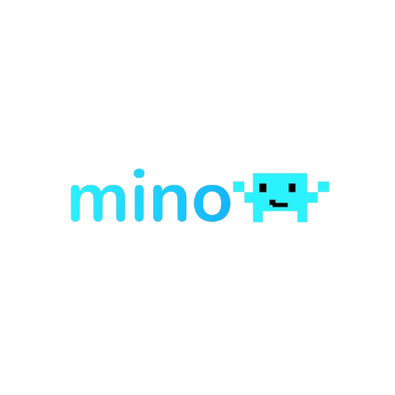

# 💻 Mino — Personal Developer AI Assistent

<p align="center">
  
</p>

An AI Assistent that help developers directly into the terminal, with the power of **qwen/qwen3-32b** Model. Think of it as your personal AI pair programmer, researcher, and assistant — always ready, always fast.

<h2 align=center>💸 Support Mino's Project</h2>
<p align=center>Loves Mino? Support us in <strong>Livepix</strong>, Your support keeps this project alive and growing! This is a 100% free, open-source project developed with countless hours of dedication.</p>

<div align=center>

**[👉 Click here to support the project](https://livepix.gg/astrooficial)**

</div>

## 🚀 Installation

### Quick Install

```
npm install -g @openmino/mino
Or...
bun add @openmino/mino
```

After installation, the `mino` command is available globally:

```
mino welcome
```

---

## ⚙️ Configuration

Mino uses **Groq API Key**, you can use your Own qwen3 API Key.

```bash
# Linux/MacOS
export AI_API_KEY

# Windows
$env:AI_API_KEY
```

## 💫 Tools

Mino can:

- write project structure files
- run commands
- search the web

## 🛠️ CLI Commands

```bash
mino welcome # - Show Mino's Welcome Panel

mino help # - Show Help(Alias: -h, --help)

mino ask # - Ask a Quick Question with qwen/qwen3-32b Model

mino update install # - Install a avaialable update
```

---

<h3 align=center>Developed with ❤️ by OpenMino and Astro</h3>
<p align=center><strong>Version 0.0.1 · 20+ Tests passing · 1 AI Model</strong></p>
